# 智能交互

机器人上配备有人脸识别和语音交互智能功能，下面将逐一为您介绍机器人这两项功能的使用。

## 人脸识别

人脸识别功能主要分为注册人脸，管理人脸和识别人脸三个部分。接下来将依次为您介绍它们的使用方法。

### 注册人脸

注册人脸分为人脸图片注册和实时拍照注册两种方式。

首先，将您的机器人连接显示器与键盘鼠标。因为机器人的开机自启动程序已经占用了人脸识别摄像头，所以要先在机器人的终端上输入如下指令终止全部服务：

```bash
sudo service xbot stop
```

释放人脸识别摄像头之后，继续输入下面指令启动ros：

```
 roscore
```

接下来就是任意从下面的两种人脸注册方式中选择一种进行人脸注册。目前支持使用摄像头交互注册和使用已有的照片注册两种方式，命令分别如下：


#### 使用摄像头交互进行注册:

```bash
 rosrun xbot_face face_register.py camera 0
```

执行以上命令就会打开一个摄像头窗口，在窗口中能够清楚的看到图像信息。此时您需要用鼠标点击摄像头窗口（此时窗口就处于激活状态），然后将人脸置于窗口中间，调整人脸在窗口中的位置和清晰度，合适时，按下R键，此时摄像头窗口的画面将会定格。（友情提示，使用非人脸，会提示人脸数据提取失败，以下示意图为处理后，请勿模仿）

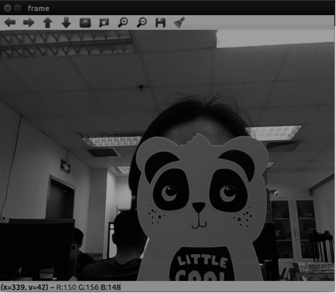 


然后返回到终端，命令窗口会提示您输入姓名拼音，如"xjpcnew03"(注意要加双引号)并回车，如果下一行返回的是0，表示注册成功，其后只需要鼠标点击摄像头窗口并按Q或者直接在终端键入ctrl+c即可退出人脸识别程序，此时就完成了一次人脸注册。

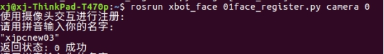 


注册的信息可以通过在浏览器中直接输入接口http://192.168.8.141:8000/management/userids返回，查看返回结果是否包含刚刚注册的id：xjpcnew03。

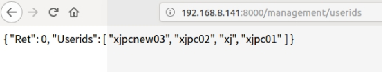 

#### 使用照片进行注册:

```
rosrun xbot_face face_register.py image [user_name] 
```

使用已有的照片进行人脸注册，需要设备上已经有了待注册用户的照片，此时我们只需要键入以下命令，并输入待命名的用户名（如xjimage01）：

 rosrun xbot_face face_register.py image xjimage01

回车执行命令之后，会弹出一个文件选择窗口，提示选择人脸照片文件：

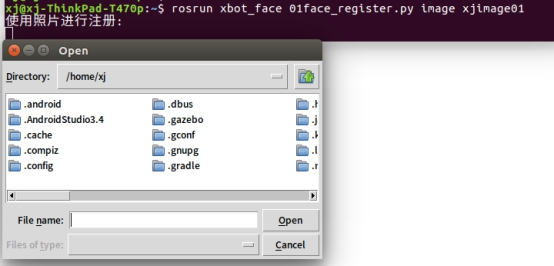 


根据人脸照片路径，选择照片即可完成注册。注册成功，返回0.

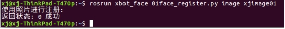 


### 人脸注册错误码

其它常见的人脸注册返回值如下表定义：

| Ret（Int） | 备注                                                    |
| ---------- | ------------------------------------------------------- |
| 0          | 正常                                                    |
| 1          | 请求超时                                                |
| 2          | 识别/核身解析结果错误                                   |
| 3          | 识别解析结果错误                                        |
| 4          | 识别解析相似度错误                                      |
| 5          | 输入信息错误                                            |
| 6          | 无该Userid对应信息                                      |
| 7          | 获取注册人脸图片数据错误                                |
| 8          | Base64解码错误                                          |
| 9          | 人脸数据提取失败（使用非人脸进行注册时会提示该信息）    |
| 10         | 删除人脸失败                                            |
| 11         | 图片过大，不超过初始配置大小（1280,720）                |
| 12         | 文件不存在                                              |
| 13         | 人脸图片打开失败                                        |
| 14         | 人脸已存在（注册人脸时method=normal情况下，userid重复） |
| 15         | 未检测到网卡                                            |
| 16         | 输入信息不合法                                          |
| 17         | 一键开门失败                                            |
| 18         | 文件读取失败                                            |
| 2019       | 恢复出厂设置失败                                        |
| 2020       | 数据清除失败                                            |
| 2021       | 获取日志列表失败                                        |
| 22         | MAC地址不匹配                                           |

 

### 识别人脸

注册完人脸之后，如果摄像头画面中出现有注册过的人脸，机器人就能够识别出相应的信息。

注意，如果您之前停止了机器人的服务，现在需要使用一键启动脚本将它们重新启动起来。一键启动指令为：

```bash
roslaunch xbot_bringup xbot-u.launch
```

我们在机器人或者从机上运行下面的指令，即可查看机器人当前识别的人脸结果。

```bash
rostopic echo /xbot/face_result
```

执行以上命令之后，会一直不停的输出以下格式的信息：

```
face_exist: False
name: "UNKNOWN"
 confidence: 0.0
```

当无人脸置于机器人人脸识别摄像头视阈范围，那么则会输出：

```
face_exist: False
name: "UNKNOWN"
confidence: 0.0
```

当机器人的人脸识别摄像头捕获到人脸信息时，会进行识别，并输出识别结果、匹配的注册用户名以及把握度信息。

```
face_exist: True
name: "xijing"
confidence: 0.632823
```


### 人脸注销

#### 注销指定用户

注销指定用户，建议在注销之前，通过http://192.168.8.141:8000/management/userids接口查询已经注册的用户id。下图中的Userids后面的数组记录的即为注册用户的id。

 

假设删除xjnew03用户，那么执行命令，返回为0则表示注销成功：

```
rosrun xbot_face face_logout.py xjnew03
```

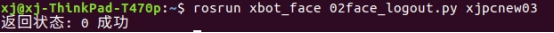 


再次访问http://192.168.8.141:8000/management/userids接口查询已经注册的用户，已经没有xjnew03，该用户已经成功被注销。

#### 注销所有用户

注销所有用户则只需要输入参数all：

```
rosrun xbot_face face_logout.py all
```

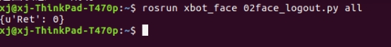 


## 语音交互

机器人中已经配置好了语音交互模块，使用该模块只需在机器人或者从机上调用相应的service，并修改相应的请求参数，即可打开内置的语音交互模块。

### 播放指定的语音文件

您还可以让机器人播放语音文件，mode:1 表示播放指定目录下的音频文件，具体的指令为：

```
rosservice call /xbot/play "loop: false
mode: 1
audio_path: '/home/xbot/catkin_ws/src/xbot/xbot_talker/defaultconfig/default_tts_test.wav'
tts_text: ''"
```

其中audio_path后面是您想要播放的语音文件的路径，该路径为**机器人本机上**的绝对目录位置，可自行修改。

### 将输入的文字转化为语音

您可以让机器人播放您输入的文字，只需要在机器人终端中输入如下指令启动/xbot/play服务即可，mode:2 表示播放模式为将文字转化为语音：

```
rosservice call /xbot/play "loop: false
mode: 2
audio_path: ''
tts_text: '请和我打招呼'"
```

其中您可以将‘请和我打招呼’替换为任何您想要播放的文字。语音播放成功后，终端会输出相应的提示：

```
success: True
```

在输入指令时，您可以使用Tab键来自动补全指令，以避免指令输入错误。补全指令后您只需修改相应参数即可。

### 对话和语音控制

/xbot/chat服务提供了与机器人进行对话以及通过语音控制机器人的交互功能。运行以下命令，即可进行交互：

```
rosservice call /xbot/chat "start_chat: true"
```

执行该指令后，机器人会在一段时间内发出“嘟——嘟——”声，您在听到声音之后即可以开始与机器人交谈。

结束对话时需要告诉机器人“关闭”或"关闭对话"。在机器人接收到语音输入的关闭指令后，会结束对话。

初始配置的机器人已经能够回答一些简单的问题，包括：你好、你多大了、你是谁、你叫什么名字、你会什么、介绍一下你自己等，以及对机器人的基本控制，"向前走一步"、"向后走一步"、"向左旋转"、"向右旋转"等，同时预留了控制机械臂和导航模块的接口。

**注意**：请在机器人响应完毕，听到“嘟”声结束后立即说命令词。预留的控制机械臂的相关命令有一定的响应时间（7s)左右，关于机械臂控制和导航相关的命令，请参考机械臂和导航使用手册。导航相关命令词会自动退出chat模式。

基本的交互内容如下表：

| 关键词                                                | 识别成功后语音回答                                           | 动作响应                                                     | 备注                                                         |
| ----------------------------------------------------- | ------------------------------------------------------------ | ------------------------------------------------------------ | ------------------------------------------------------------ |
| 向前走/向前走一步                                     | 无                                                           | 机器人向前一段距离                                           |                                                              |
| 向后走/向后走一步                                     | 无                                                           | 机器人后退一段距离                                           |                                                              |
| 向左旋转/向左转                                       | 无                                                           | 机器人向左旋转                                               |                                                              |
| 向右旋转/向右转                                       | 好的                                                         | 机器人向右旋转                                               |                                                              |
| 你好                                                  | 你好，我是机器人小德                                         | 无                                                           |                                                              |
| 你叫什么名字                                          | 我叫小德                                                     | 无                                                           |                                                              |
| 你多大了/你几岁了                                     | 我已经三岁啦                                                 | 无                                                           |                                                              |
| 你来自哪里                                            | 我来自重德智能                                               | 无                                                           |                                                              |
| 介绍一下你自己/你自我介绍一下/介绍你自己/你是谁       | 我是来自重德智能的机器人小德。集科研、教育、服务于一身。能为您提供自主导航、人脸识别、语音交互和自动抓取等多种功能。 | 无                                                           |                                                              |
| 你会什么/你会做什么                                   | 我具有自主导航、人脸识别、语音交互、自动抓取等多种功能，将是您学习和科研的好帮手。 | 无                                                           |                                                              |
| 介绍一下重德智能/介绍重德智能                         | 北京中科重德智能科技有限公司是源自中国科学院的创业公司。公司致力于研发智能机器人科研教学平台。提供稳定可靠、安全高效的机器人软硬件一体化解决方案 | 无                                                           |                                                              |
| 你爸爸是谁                                            | 我爸爸是重德智能帅气可爱的工程师哟                           | 无                                                           |                                                              |
| 你妈妈是谁                                            | 我妈妈是重德智能漂亮可爱的工程师哟                           | 无                                                           |                                                              |
| 很高兴见到你                                          | 和你的每一次遇见都是我的小确幸。                             | 无                                                           |                                                              |
| 你喜欢什么                                            | 我最喜欢和你聊天啦                                           | 无                                                           |                                                              |
| 向上看                                                | 无                                                           | 头部俯仰云台向上偏转40度                                     |                                                              |
| 向下看                                                | 无                                                           | 头部俯仰云台向下偏转40度                                     |                                                              |
| 向左看                                                | 无                                                           | 头部水平云台向左偏转60度                                     |                                                              |
| 向右看                                                | 无                                                           | 头部水平云台向右偏转60度                                     |                                                              |
| 向前看/转台回到初始位置                               | 无                                                           | 头部两个云台回到初始0度位置                                  |                                                              |
| 开始对话/开始多轮交互模式                             | 好的，我们可以进行连续多次对话交互啦。                       | 无                                                           | 在语音唤醒模式下，该关键词会开始多轮交互模式。               |
| 陪我聊天/能和我聊会天吗                               | 好啊，我们可以聊天啦。                                       | 无                                                           | 在语音唤醒模式下，该关键词会开始多轮交互模式。               |
| 再见                                                  | 期待与你的下次相遇                                           | 退出/chat服务，结束对话。                                    | 在语音唤醒模式下，该关键词会退出多轮交互模式，进入等待唤醒状态。 |
| 关闭/关闭对话/关闭多轮交互模式/退出聊天/退出对话      | 好的，小德先退下啦。                                         | 退出/xbot/chat服务，结束对话。                               | 在语音唤醒模式下，该关键词会退出多轮交互模式，进入等待唤醒状态。 |
| 抬起左手/放下左手/抬起右手/放下右手/抬起手臂/放下手臂 | 好的                                                         | 控制机械臂的抬起和放下                                       | 若购买xbot-arm产品，会看到机械臂动作，请确保机械臂0.7m范围内无障碍物。 |
| 张开左手/闭合左手/张开右手/闭合右手/张开手爪/闭合手爪 | 好的                                                         | 控制机械臂手爪的打开和闭合                                   |                                                              |
| 参观/带我参观                                         | 好的。请跟我来                                               | 向/demo/leave、/demo/visit和/welcome/yes话题发布true，同时自动退出对话 | 用户可自行编写脚本订阅这三个话题其中一个，开始导航。         |
| 开始导航                                              | 收到。                                                       | 向/demo/leave、/demo/visit和/welcome/yes话题发布true，同时自动退出对话交互 | 用户可自行编写脚本订阅这三个话题其中一个，开始导航。         |
| 暂停导航                                              | 收到                                                         | 向/demo/navi_pause话题发布true，同时自动退出对话             |                                                              |
| 继续导航                                              | 收到                                                         | 向/demo/navi_continue话题发布true，同时自动退出对话          |                                                              |
| 回到原点/回到起点/小德你回去吧                        | 好的，我将返回起始点。                                       | 向/demo/navi_to_pose话题发布”Starting_Point“，同时自动退出对话 | 目标点的信息需与导航json文件内的设置对应。                   |
| 去第一个目标点                                        | 收到                                                         | 向/demo/navi_to_pose话题发布”First_Goal“，同时自动退出对话   | 目标点的信息需与导航json文件内的设置对应。                   |
| 去第二个目标点                                        | 收到                                                         | 向/demo/navi_to_pose话题发布”Second_Goal“，同时自动退出对话  | 目标点的信息需与导航json文件内的设置对应。                   |
| 去第三个目标点                                        | 收到                                                         | 向/demo/navi_to_pose话题发布”Third_Goal“，同时自动退出对话   | 目标点的信息需与导航json文件内的设置对应。                   |
| 去第四个目标点                                        | 收到                                                         | 向/demo/navi_to_pose话题发布”Fourth_Goal“，同时自动退出对话  | 目标点的信息需与导航json文件内的设置对应。                   |
| 去第五个目标点                                        | 收到                                                         | 向/demo/navi_to_pose话题发布”Fifth_Goal“，同时自动退出对话   | 目标点的信息需与导航json文件内的设置对应。                   |
| 带我找方总/去方总办公室                               | 无                                                           | 向/demo/navi_to_pose话题发布”fang_zong_office“，同时自动退出对话 | 目标点的信息需与导航json文件内的设置对应。                   |
| 带我找常总/去常总办公室                               | 无                                                           | 向/demo/navi_to_pose话题发布”chang_zong_office“，同时自动退出对话 | 目标点的信息需与导航json文件内的设置对应。                   |

### 自定义对话内容

初始配置的机器人已经能够回答一些简单的问题，包括：你好、你多大了、你是谁、你叫什么名字、你会什么、介绍一下你自己等，以及对机器人的基本控制，"向前走一步"、"向后走一步"、"向左旋转"、"向右旋转"等，同时预留了控制机械臂和导航模块的接口。

用户也可按照下面的教程修改或添加自定义的对话内容。

#### 1.配置文件说明

与定义对话内容相关的配置文件有两个，一个是语法文件，一个是定义的对话库。

xbot_talker/defaultconfig/grammar.bnf离线语法文件是科大讯飞离线命令词识别的基础，里面定义了能够被离线识别的所有关键词（在线识别可随意输入，不受影响）。文件内容如下：

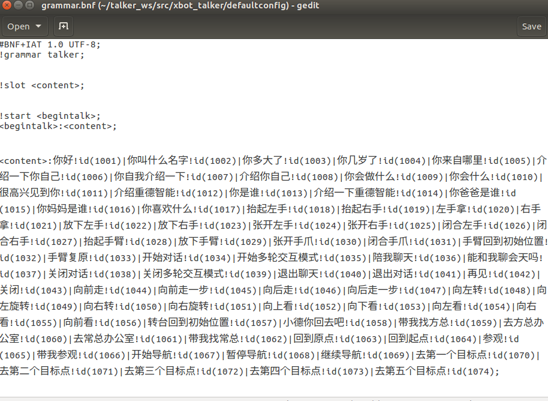

xbot_talker/defaultconfig/answer_dic.csv文件是离线语言处理问答库，里面定义了与语法文件中对应的关键词的所有相应策略。nlp模块接收到语音识别结果后，会到此文件搜索响应的策略并进行响应。

文件部分内容如下图所示：

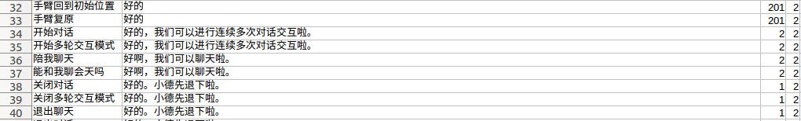

answer_dic.csv表格内一共有四列:

- 第一列为语音识别的关键词，与grammar.bnf离线语法文件内定义一致；
- 第二列为对应的回答或其他响应；
- 第三列数字代表机器人的动作编号RobotAciton。
  - RobotAciton编号和对应动作如下表：

| 编号 | 动作行为                  | 说明                                                         |
| ---- | ------------------------- | ------------------------------------------------------------ |
| 0    | NO_ACTION                 | 无动作响应                                                   |
| 1    | CLOSE_CHAT                | 关闭chat对话模式                                             |
| 2    | START_CHAT                | 进入chat对话模式，用户可在嘟声后连续进行多次对话交互         |
| 101  | TAKE_A_STEP_FORWARD       | 向/cmd_vel_mux/input/teleop话题发消息控制机器人前进一步      |
| 102  | TAKE_A_STEP_BACKWARD      | 向/cmd_vel_mux/input/teleop话题发消息控制机器人后退一步      |
| 103  | TURN_LEFT                 | 向/cmd_vel_mux/input/teleop话题发消息控制机器人向左旋转      |
| 104  | TURN_RIGHT                | 向/cmd_vel_mux/input/teleop话题发消息控制机器人向右旋转      |
| 105  | LOOK_UP                   | 向/mobile_base/commands/pitch_platform发消息控制俯仰云台向上转40度 |
| 106  | LOOK_DOWN                 | 向/mobile_base/commands/pitch_platform发消息控制俯仰云台向下转40度 |
| 107  | LOOK_LEFT                 | 向/mobile_base/commands/yaw_platform 发消息控制水平云台向左转60度 |
| 108  | LOOK_RIGHT                | 向/mobile_base/commands/yaw_platform 发消息控制水平云台向右转60度 |
| 109  | LOOK_FORWARD              | 两个云台回到初始0度位置。                                    |
| 201  | RESET_ARM                 | 向/arm/commands/reset发消息控制所有机械臂回到初始位置        |
| 202  | RAISE_LEFT_HAND           | 向/left_arm/commands/lift_up 发消息控制双臂机械臂的左臂抬起来 |
| 203  | PUT_DOWM_LEFT_HAND        | 向/left_arm/commands/put_down 发消息控制双臂机械臂的左臂回到初始位置 |
| 204  | RAISE_RIGHT_HAND          | 向/right_arm/commands/lift_up 发消息控制双臂机械臂的右臂抬起来 |
| 205  | PUT_DOWM_RIGHT_HAND       | 向/right_arm/commands/put_down 发消息控制双臂机械臂的右臂回到初始位置 |
| 206  | LEFT_HAND_GRIP            | 向/left_arm/commands/grip 发true控制双臂中左手手爪闭合       |
| 207  | LEFT_HAND_OPEN            | 向/left_arm/commands/grip 发false控制双臂中左手手爪张开      |
| 208  | RIGHT_HAND_GRIP           | 向/right_arm/commands/grip 发true控制双臂中右手手爪闭合      |
| 209  | RIGHT_HAND_OPEN           | 向/right_arm/commands/grip 发false控制双臂中右手手爪张开     |
| 210  | RAISE_ARM                 | 向/arm/commands/lift_up 发消息控制单臂机械臂抬起来           |
| 211  | PUT_DOWN_ARM              | 向/arm/commands/put_down 发消息控制单臂机械臂回到初始位置    |
| 212  | OPEN_GRIPPER              | 向/arm/commands/grip发false控制单臂机械臂的手爪的张开        |
| 213  | CLOSE_GRIPPER             | 向/arm/commands/grip发true控制单臂机械臂的手爪的闭合         |
| 301  | NAVI_START                | 向/demo/leave、/demo/visit和/welcome/yes话题发布true，同时自动退出对话交互 |
| 302  | NAVI_TO_POSE              | 向/demo/navi_to_pose话题发布answer_dic.csv表格第二列内设置的关键点string，同时自动退出对话开始导航，例如设置为“chang_zong_office” |
| 303  | NAVI_CANCEL               | 向/demo/navi_pause话题发布true，暂停导航，同时自动退出对话   |
| 304  | NAVI_CONTINUE             | 向/demo/navi_continue话题发布true，继续导航，同时自动退出对话 |
| 305  | BACK_TO_ORIGINAL_LOCATION | 向/demo/navi_to_pose话题发布”Starting_Point“，导航至起点，同时自动退出对话 |
| 311  | NAVI_TO_FIRST_POSE        | 向/demo/navi_to_pose话题发布”First_Goal“，同时自动退出对话   |
| 312  | NAVI_TO_SECOND_POSE       | 向/demo/navi_to_pose话题发布”Second_Goal“，同时自动退出对话  |
| 313  | NAVI_TO_THIRD_POSE        | 向/demo/navi_to_pose话题发布”Third_Goal“，同时自动退出对话   |
| 314  | NAVI_TO_FOURTH_POSE       | 向/demo/navi_to_pose话题发布”Fourth_Goal“，同时自动退出对话  |
| 315  | NAVI_TO_FIFTH_POSE        | 向/demo/navi_to_pose话题发布”Fifth_Goal“，同时自动退出对话   |

- 第四列编号为 动作模式ActionMode，编号和说明如下表

  | 编号 | 模式                 | 说明                                                         |
  | ---- | -------------------- | ------------------------------------------------------------ |
  | 0    | PLAY_ONLY            | 将answer_dic.csv表格第二列内的文字转化成语音并播放回答，无任何动作响应。 |
  | 1    | ACTION_ONLY          | 只根据answer_dic.csv表格第三列内的RobotAciton进行动作，无任何语音回答。 |
  | 2    | PLAY_BEFORE_ACTION   | 先播放语音回答再动作。                                       |
  | 3    | PLAY_AND_ACTION_SYNC | 播放语音回答和动作同时进行。                                 |
  | 4    | PLAY_AFTER_ACTION    | 先进行动作，再播放语音回答。                                 |

#### 2.只修改语音回答或反馈

参照上一小节的说明，用户若想修改某个关键词对应的语音回答或反馈提示，只需修改xbot_talker/defaultconfig/answer_dic.csv文件第二列的内容。

例如，关键词“你喜欢什么”设定的原回答是“我最喜欢和你聊天啦”，用户可修改第二列的“我最喜欢和你聊天啦”为其他回答“我喜欢学习。也喜欢你”。

**注意:第二列的回答如果分多语句，中间不可用英文标点，最好都用中文句号隔开。**

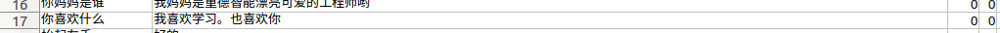

修改后保存，重新启动程序，与机器人对话，就可听到机器人的回答已改变。

#### 3.添加自定义关键词和问答库

除了已经设定好的离线关键词，用户还可以自己添加关键词，设置问答库。

- 1.在defaultconfig/grammar.bnf离线语法文件内添加关键词。打开语法文件，在文件末尾添加需要被识别的关键词，id号依次递增。例如想添加一个命令控制机器人开始在博物馆内导航，可以在语法文件末尾添加关键词“|带我参观博物馆!id(1075)”，文件修改后如下：

  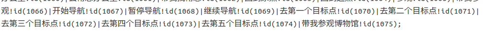

- 2.接着在defaultconfig/answer_dic.csv文件内添加响应策略。第一列输入“带我参观博物馆”，第二列输入想要的回答语句，例如“好的。请跟我来。我将为您导航”，第三列按照第一小节的表格，设置RobotAction为301（NAVI_START），第四列设置动作模式为2（先播放语音回答再动作）。

  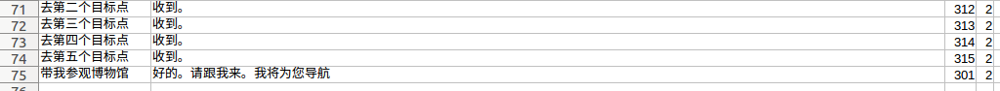

- 3.保存文件的修改并重新启动程序，可与机器人进行交互，设置成功后机器人可准确识别关键词“带我参观博物馆”并反馈语音回答，回答结束后向/demo/leave、/demo/visit和/welcome/yes话题发布true。具体的导航行为请参考导航章节。

更多关于xbot_talker语音对话的内容，请查看[xbot_talker各模块说明](talker)。


## 调节机器人的输出音量

如果需要调节机器人喇叭音量，请通过外接鼠标键盘显示器，点击ubuntu系统屏幕右上角喇叭图标，选择Sound Settings。

选择Output标签页，调节Output volume调节输出音量；点击Test Sound可以看到左喇叭和右喇叭分别测试的Test按钮，检测左右喇叭是否正常发音，方向是否准确，音量是否洪亮。

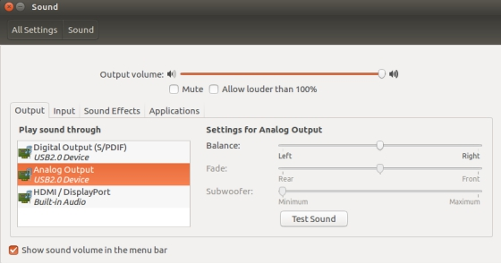 


