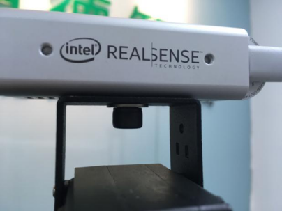
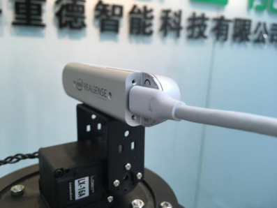
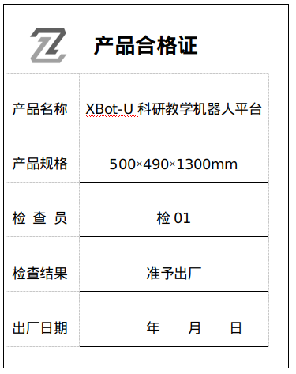
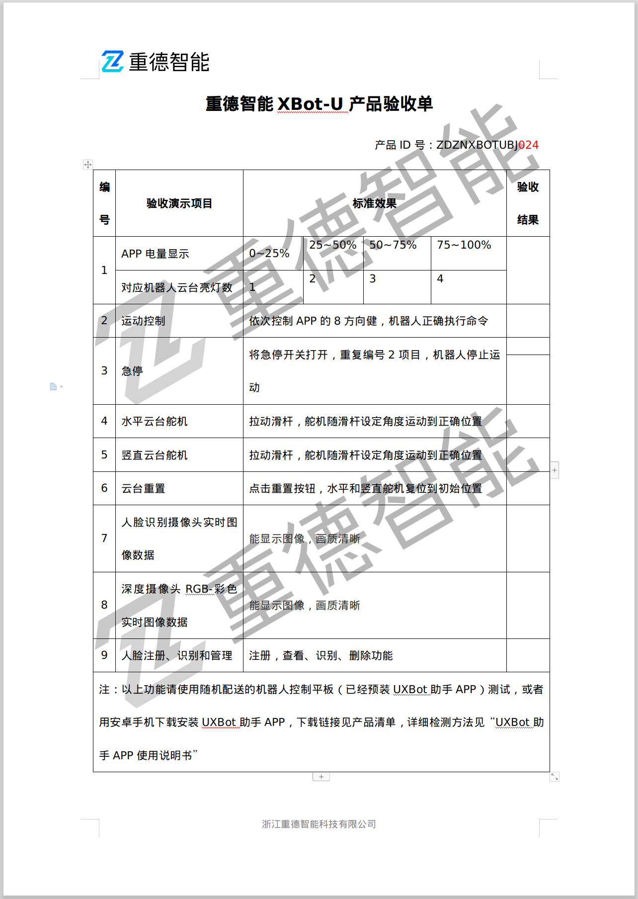

# 产品开箱及使用规范

## 产品开箱

### 开箱

机器人使用木质箱体进行装箱，其中填充泡沫塑料防撞。

开箱时请将包装箱平放在地面，并将写有正面的一面朝上，使用扳手将包装箱上的螺钉拧下即可打开箱门。

### 安装

当您拿到XBot-U机器人时大部分的组装工作已经完成，您只需执行如下两步：

1. 将两根天线接到底盘金色天线接头上。
2. 将Realsense RGBD摄像头安装到机器人顶部的云台上。

下面介绍如何安装Realsense RGBD摄像头。

首先，使用配套的固定螺丝将Realsense RGBD摄像头固定到机器人顶部的云台上，然后将摄像头通过Type-c接口与机器人相连，Realsense RGBD摄像头安装完毕。

安装好后的Realsense RGBD摄像头如下图：

 

 

 

## 产品验收

### 产品合格证

开箱之后，请检查箱体内随机器人一体配送的机器人产品合格证。

### 出货清单

检查完产品合格证后，请查看机器人箱体内包含以下《产品出货清单》中的所有部件。

| 出货项目                             | 数量 |
| ------------------------------------ | ---- |
| XBot-U机器人主机                     | 1台  |
| 机器人控制平板（已预装UXBot助手APP） | 1台  |
| Realsense RGBD摄像头（附固定螺钉）   | 1台  |
| XBot-U机器人标准充电器               | 1台  |

### 电子资料下载

2. [机器人Android应用APP](https://www.droid.ac.cn/files/xbot_app-V2.0.2171.apk)
3. [产品验收单](https://www.droid.ac.cn/files/yanshoudan.docx)

### 验收单

请按照我们给出的《重德智能XBot-U产品验收单》对机器人进行逐项检测和验货，确认机器人功能正常。

机器人验收单上的项目使用随机器人配带的平板pad上的app进行逐项检查验收，点击查看[app使用方法](app)

## 机器人使用规范

### 规范目的

1. 明确对机器人存储环境的要求
2. 明确对机器人使用环境的要求
3. 明确由谁操作，由谁保养，什么时候保养
4. 明确保养项目，项目要求

### 存储环境

| 温度                                                         | -10~45℃  |
| ------------------------------------------------------------ | -------- |
| 湿度                                                         | 65±20%RH |
| 1、无虫、干燥、无阳光直射的室内 2 、机器人周围0.5范围内无其它障碍物 3 、机器人需放置在水平地面上，且4轮自然着地。 |          |

 注：

1. 长时间存储需置于温度23±5℃，湿度为65±20%RH环境中。
2. 需充满电后存储。
3. 存储期间，每30天需给机器人充电至满电状态。
4. 存储期间，务必使用布袋将机器人包裹住，减少灰尘落在机器人表面和内部。 

### 充电环境

| 温度                                                         | 0~45℃      |
| ------------------------------------------------------------ | ---------- |
| 湿度                                                         | 65±20%RH   |
| 充电器                                                       | 原装充电器 |
| 充电时长                                                     | 10H        |
| 充电电压                                                     | 29.4V      |
| 充电电流                                                     | <4A        |
| 1、无虫、无尘、干燥、无阳光直射的室内 2、 机器人周围0.5范围内无其它障碍物 3 机器人需放置在水平地面上，且4轮自然着地。 4 当机器人头部电源指示灯指示1颗灯时，请尽快使用原装充电器充电。 |            |

### 放电环境

| 温度                         | -10~50℃  |
| ---------------------------- | -------- |
| 湿度                         | 65±20%RH |
| 待机                         | 20H      |
| 全速运行                     | 5H       |
| 无虫、干燥、无阳光直射的室内 |          |

### 运输环境

| 温度                                                         | -10~65℃  |
| ------------------------------------------------------------ | -------- |
| 湿度                                                         | 65±20%RH |
| 1 无虫、干燥、无阳光直射 2 长途请使用原装包装材料和木箱运输 3 短途请将机器人稳固放置在推车上运输 |          |

### 使用环境

| 温度                                   | -10~50℃  |
| -------------------------------------- | -------- |
| 湿度                                   | 65±20%RH |
| 无虫、干燥、无阳光直射、地面平整的室内 |          |

### 保养细则

保养需指定责任人、指定保养时间，确定的保养项目和要求。推荐的保养细则见下表：

| 保养项目                                      | 保养保准                                                     |
| --------------------------------------------- | ------------------------------------------------------------ |
| 表面有无异物                                  | 无油渍、无水渍                                               |
| 外露的螺丝螺母是否松动                        | 无脱落、无松动                                               |
| 开机                                          | 机器人启动后，显示面板电流显示在2A以下。                     |
| 电池电量                                      | 机器人头部电源指示灯需亮3颗灯或4颗灯，否则需要充电至满电。   |
| 环境温湿度                                    | 见存储环境要求                                               |
| 使用APP遥控机器人，检查舵机和电机运动是否正常 | 响应APP发出的命令2 能准确执行APP发出的命令                   |
| 充电                                          | 充电过程中，充电器指示灯为红色长亮；充满电后，指示灯为绿色长亮 |

 