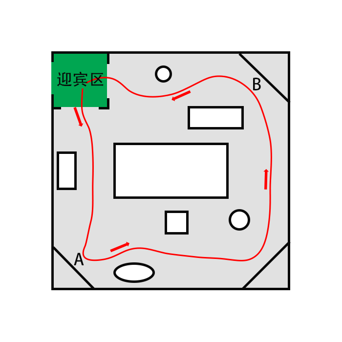

# XBot-U机器人进阶-部署服务机器人

## 简介

该部分将介绍如何使用XBot-U科研教学平台，搭建一款室内讲解服务机器人应用。

讲解机器人的功能如下图所示：



机器人在迎宾区（建图起点）等待游览人员前来参观，游客站在机器人面前后，机器人人脸识别游客，若该游客未注册人脸，则提醒其注册；

如果该游客已注册人脸，则根据相应的问候语发出语音问候；

如果该游客已注册人脸并且被标记为VIP，则语音问候之后开启对话，识别到“带我参观”之后则进行带领参观，机器人逐渐前往已标记的关键点A、B……并说出对应关键点的讲解词。

为实现该讲解服务机器人，使用到的XBot-U功能包括：

- 机器人建图
- 机器人自主导航
- 机器人自主避障
- SLAM
- 人脸识别
- 语音交互
- 语音TTS

以下操作均采用机器人与笔记本ROS联机的方式运行，机器人为【主机】，笔记本为【从机】。

## 建图

### 停止自启服务

【主机】将机器人开机后，首先ssh登录xbot停止自启服务：

```
sudo service xbot stop
```

### 运行建图程序

将机器人放置在合适的起点，并做好标记**记住该建图起始点**。

【主机】在机器人上运行：

```
roslaunch xbot_navi build_map.launch
```

【从机】同时在笔记本从机上运行

```
roslaunch xbot_navi view_rviz.launch
```

来查看机器人的实时建图情况。

使用rviz中的2D Nav Goal工具引导机器人导航或者使用键盘遥控控制机器人在环境内移动，直到机器人建立你所需要的场所中多个讲解点即可。

### 保存地图

【主机】将地图保存到xbot_navi/map文件夹下：

```
roscd xbot_navi/map
rosrun map_server map_saver -f fuwu
```

至此，建图过程即完成，退出主机和从机终端中所有程序。

## 标点

【主机】继续接建图之后，首先修改xbot_navi/launch/load_map.launch文件中的地图文件名为刚才保存的地图fuwu。

```yaml
<arg name="map_file"       default="$(find xbot_navi)/map/fuwu.yaml" />
```

【主机】然后运行标点加载地图程序：

```
roslaunch xbot_navi load_map.launch
```

【主机】在机器人上运行标点程序：

```
rosrun xbot_navi input_keypoint.py
```

运行完成后首先在命令行提示中输入想要标记点的个数回车。

【从机】同时在笔记本从机上运行

```
roslaunch xbot_navi view_rviz.launch
```

然后在rviz中使用2D Nav Goal工具逐个点击地图上自己想要标记的点位，标记的同时也可以用鼠标指向对应的方向。

点击完成所有的标记点位之后， input_keypoint.py会提示标记完成，请退出程序。

标记后的关键点配置文件会自动保存到机器人上的xbot_navi/json/kp.json文件。

至此标点程序完成。

## 修改配置文件

以下配置文件的修改都在机器人主机上完成，建议采用远程ssh+vim的方式修改或者连接鼠标键盘显示器修改。

### 问候人脸配置文件

程序的两个配置文件存储在了xbot_navi/json目录下。

请提前在机器人上注册好人脸，并记下注册的name。

其中greet.json是问候人脸的配置文件，文件内容包括：

```
{
	"wangpeng": 
	{
		"isVIP": true,
		"greet_words": "小主汪鹏您好，请问有什么吩咐？"
	},
 	"fangyang": 
 	{
 		"isVIP": true, 
 		"greet_words": "方总您好，下面请您给客户演示一下公司的迎宾机器人小德的功能，谢谢。"
	}
}
```

文件内容采用：

```
人脸注册姓名：{

是否是VIP，

识别成功后打招呼的文字。

}
```

的方式存储，isVIP字段为是否接待打开对话的关键字。

未注册用户不在该配置文件中人脸识别后机器人会说：您好，我还不认识您，如有需要请注册。

已注册人脸并且姓名在此文件中的但是非VIP的人脸识别后机器人会只打招呼说出greet_words但不对话。

已注册人脸并且姓名在此文件中并且是VIP的，则会在打招呼说出greet_words后开启语音对话。

## 关键点配置文件

关键点配置文件为上一步标点所保存的文件，kp.json。

```
[
	{
		"recog": false,
		"play": true, 
		"name": "kp1", 
		"pose": [[-0.38369810581207275, -6.607648849487305, 0.0], [0.0, 0.0, 0.9999874980538496, -0.005000373586267479]], 
		"play_words": "方总您好，有客户找您，请接待。", 
		"chat": false
	}, 
	{
		"recog": false,
		"play": true,
		"name": "kp2", 
		"pose": [[-0.01476144790649414, 0.019881725311279297, 0.0], [0.0, 0.0, 0.0, 1.0]], 
		"play_words": "接待已完成。", 
		"chat": false
	}
]
```

该文件采用数组存储关键点的方式，关键点数据类型为：

```
{
在该点是否人脸识别，
是否语音播放内容，
点的名称，
点的坐标，
语音播放的内容，
是否对话
}
```

请按照自己的需求修改配置文件。

对于讲解机器人，在人脸识别后会进行一次对话，其他关键点建议不要开启语音对话和人脸识别，相应字段设为false即可。


## 运行程序

【主机】修改xbot_navi/launch/demo.launch文件，也是将该行的地图修改为建图所保存的fuwu.yaml。

```
<arg name="map_file"       default="$(find xbot_navi)/map/fuwu.yaml" />
```

请将机器人放置到上面**开始建图的所标记的起点**，朝向保持一致。

【主机】运行服务机器人程序

```
roslaunch xbot_navi demo.launch
```

然后注册过的人员站到机器人面前即可触发讲解服务机器人流程。

对话过程中“带我参观”作为关键词触发机器人前往讲解点，更多关于xbot_talker语音对话的内容，请查看[xbot_talker各模块说明](talker)。