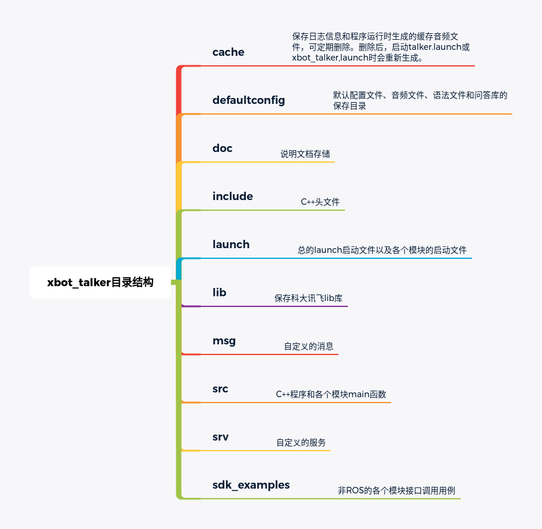
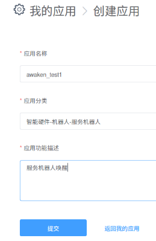
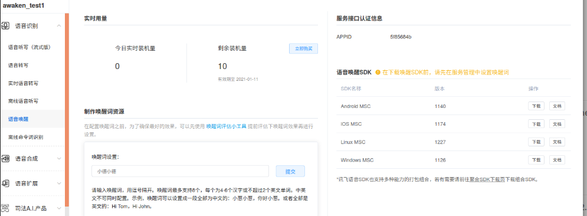

# xbot_talker各模块说明

xbot_talker由语音识别模块asr_sample、语音合成模块tts_sample、语言处理模块nlp_sample和语音唤醒模块awaken_sample组成。整个功能包的目录架构如下图：



各个模块的参数和接口说明如下。


### 1.语音识别模块

asr_sample节点提供了科大讯飞离线命令词识别、科大讯飞在线语音识别以及百度在线语音识别三种接口，用户可通过修改asr_module.launch 里的参数选择使用不同接口进行语音识别。由于xbot-u机器人启动时不连接外网，所以真机运行时仅启动科大讯飞离线命令词识别一种识别接口。其他识别接口用户可在自己的电脑主机上进行测试。

####  启动asr节点

- 启动asr节点：

  ```
  roslaunch xbot_talker asr_module.launch
  ```

#### 参数Parameters

- base_path:到xbot_talker的绝对路径，不可更改。

- enable_xfei_online: 开启讯飞在线识别，需在网络状况良好的情况下使用。
- enable_baidu_online: 开启百度在线识别，需在网络状况良好的情况下使用。
- enable_xfei_offline: 开启讯飞离线命令词识别，有无网络都可使用。
- use_pcm_file： 用于识别的输入为录好的音频文件。
- pcm_file: 用于识别的音频文件，默认为单声道pcm格式的音频文件。
- audio_channel：输入的音频声道数，默认单声道。
- use_mic: 用于识别的输入为麦克风实时录音。
- enable_record_save ：是否保存麦克风录音缓存到cache/pcm目录下。
- record_time : 一次识别的录音时长，默认3.5s，最大值4.5s。
- grammar_path：科大讯飞离线语法文件路径，不可更改。
- log_path：生成的识别日志存储路径，识别结果和置信度信息默认存储在xbot_talker/cache/log/asr_recog_result_log.csv文件内。
- baidu_api_key：注册百度在线语音识别应用时创建的api_key，用户可使用提供的api_key，也可自己注册百度识别应用修改此参数。
- baidu_secret_key：注册百度在线语音识别应用时创建的secret_key，用户可使用提供的secret_key，也可自己注册百度识别应用修改此参数。

#### 订阅话题Subscribed Topics

- /talker/enable_asr(std_msgs/Bool.msg): 是否开启语音识别（一轮）。
- /asr_module/enable_beep(std_msgs/Bool.msg): 是否在语音识别前播放“嘟”提示音，true：开启；false：关闭。调用/talker/chat和/xbot/chat服务时会自动开启“嘟”提示音。

#### 发布话题Published Topics

- /talker/offline_recog_result(xbot_talker/recog_result.msg)：离线语音识别结果，包含命令词和置信度信息。若同时开启离线识别和在线识别，优先发布此结果用于nlp模块的处理。
- /talker/online_recog_result(xbot_talker/online_asr_result.msg):在线语音识别的结果。若同时开启科大讯飞在线识别或百度在线识别，优先发布科大讯飞识别结果。
- /talker/xfei_offline_recog_result(xbot_talker/recog_result.msg):科大讯飞离线语音（离线命令词）识别结果。
- /talker/xfei_online_recog_result(xbot_talker/online_asr_result.msg):科大讯飞在线语音识别的结果。
- /talker/baidu_online_recog_result(xbot_talker/online_asr_result.msg):科大讯飞在线语音识别的结果。
- /nlp_module/enable_chat(std_msgs/Bool.msg):是否让nlp模块在处理语音识别结果时按照多轮对话交互模式进行处理，调用/talker/chat和/xbot/chat服务时会自动开启。

#### 提供的service服务端

- /talker/version(xbot_talker/CallVersion.srv):获取语音交互软件版本，请求参数为empty，返回版本信息。

- /talker/chat(xbot_talker/CallChat.srv):开启多轮对话交互服务，请求参数为bool型的start_chat，开启时为true。请求成功后返回chat_success: True。

- /xbot/chat(xbot_talker/chat.srv):兼容3.2.4之前版本的接口，使用同之前相同，开启多轮对话交互服务，请求成功后返回chat_success: True。

  

### 2.语音合成模块

tts_sample节点提供了科大讯飞离线语音合成功能，能够播放特定的音频文件，能够将文字合成成语音并播放。

####  启动tts节点

- 启动asr节点：

  ```
  roslaunch xbot_talker tts_module.launch
  ```

#### 参数Parameters

- base_path:到xbot_talker的绝对路径，不可更改。

- log_path：合成的音频文件的缓存目录，默认存储在xbot_talker/cache/log目录内。

#### 提供的service服务端

- /talker/play(xbot_talker/CallPlay.srv):语音播放服务接口，请求的参数说明：
  - loop_times：表示循环播放的次数，0表示只播放一遍，1表示共播放2遍…loop_times表示共播放(loop_times+1)遍。
  - mode：播放模式。0表示把文字（tts_text）合成语音并播放；1表示播放指定的文件（audio_path）。
  - audio_path：mode = 1时播放的音频文件。
  - tts_text：mode =0 时转化的文字。
- /xbot/play(xbot_talker/play.srv):兼容3.2.4之前版本的接口，使用同之前相同，语音播放服务接口，请求的参数说明：
  - loop: 是否循环播放，默认false，不可更改。
  - mode：播放模式。2表示把文字（tts_text）合成语音并播放；1表示播放指定的文件（audio_path）。
  - audio_path：mode = 1时播放的音频文件。
  - tts_text：mode =2时转化的文字。
- /talker/xbot_tts(xbot_talker/XbotTts.srv): 科大讯飞离线语音合成接口，请求的参数为：
  - start_tts：true表示开启语音合成。
  - tts_text：需要合成的文字。


### 3.语言处理模块

识别结果的处理模块，包括检测识别结果是否存在响应、进行响应、控制机器人移动、控制机械臂等功能。

####  启动nlp节点

- 启动nlp节点：

  ```
  roslaunch xbot_talker nlp_module.launch
  ```

#### 参数Parameters

- base_path:到xbot_talker的绝对路径，不可更改。
- nlp_config_path:设置的离线问答库，默认为xbot_talker/defaultconfig/answer_dic.csv。

- log_path：生成的日志存储路径，默认存储在xbot_talker/cache/log/文件内。
- tuling_key：注册图灵在线问答机器人应用时创建的api_key，用户可使用提供的api_key，也可自己注册图灵应用修改此参数。

#### 订阅话题Subscribed Topics

- /talker/offline_recog_result(xbot_talker/recog_result.msg)：订阅离线语音识别结果，包含命令词和置信度信息。针对识别结果，在defaultconfig/answer_dic.csv离线问答库内查询响应策略并进行响应。
- /talker/online_recog_result(xbot_talker/online_asr_result.msg):订阅在线语音识别的结果。
- /nlp_module/enable_chat(std_msgs/Bool.msg):是否在处理语音识别结果时按照多轮对话交互模式进行处理。若为true，则语音识别结果响应结束后，会自动进入语音识别模块，开启下一轮对话；若为false，则响应结束后不再进入语音识别模块，结束对话，若启动了语音唤醒节点，则会进入等待唤醒状态。

#### 发布话题Published Topics

- /talker/enable_asr (std_msgs/Bool.msg):从此话题发布true消息开启语音识别模块，进入下一轮对话。
- /talker/enable_awake (std_msgs/Bool.msg):从此话题发布true的消息进入语音唤醒模式。
- /asr_module/enable_beep (std_msgs/Bool.msg):是否开启语音识别前的"嘟"提示音。
- /cmd_vel_mux/input/teleop (geometry_msgs/Twist.msg):发布机器人运动的速度信息，控制机器人前进后退和左右旋转。
- /mobile_base/commands/pitch_platform (std_msgs/Int8.msg):控制俯仰云台的转动。
- /mobile_base/commands/yaw_platform (std_msgs/Int8.msg):控制水平云台的转动。
- /arm/commands/grip (std_msgs/Bool.msg):控制单臂机械臂的手爪的开合。
- /arm/commands/lift_up (std_msgs/Empty.msg):控制单臂机械臂抬起来。
- /arm/commands/put_down (std_msgs/Empty.msg):控制单臂机械臂放下，回到初始位置。
- /arm/commands/reset (std_msgs/Empty.msg):控制所有机械臂回到初始位置。
- /left_arm/commands/grip (std_msgs/Bool.msg):控制双臂中左手手爪的开合。
- /left_arm/commands/lift_up (std_msgs/Empty.msg):控制左手臂抬起来。
- /left_arm/commands/put_down (std_msgs/Empty.msg):控制左手臂放下，回到初始位置。
- /right_arm/commands/grip (std_msgs/Bool.msg):控制双臂中右手手爪的开合。
- /right_arm/commands/lift_up (std_msgs/Empty.msg):控制右手臂抬起来。
- /right_arm/commands/put_down (std_msgs/Empty.msg):控制右手臂放下，回到初始位置。
- /demo/leave (std_msgs/Bool.msg):预留的导航相关接口，“参观”、“带我参观”和“开始导航”会向此话题发布true的消息。
- /demo/visit (std_msgs/Bool.msg):预留的导航相关接口，“参观”、“带我参观”和“开始导航”会向此话题发布true的消息。
- /welcome/yes (std_msgs/Bool.msg):预留的导航相关接口，“参观”、“带我参观”和“开始导航”会向此话题发布true的消息。
- /demo/navi_to_pose (std_msgs/String.msg):预留的导航相关接口，导航到某个目标点，与json文件设置对应。
- /demo/navi_pause (std_msgs/Bool.msg)：暂停导航。
- /demo/navi_continue (std_msgs/Bool.msg)：继续导航。

#### service客户端

- /talker/version(xbot_talker/CallVersion.srv):获取语音交互软件版本，请求参数为empty，返回版本信息。
- /talker/xbot_tts(xbot_talker/XbotTts.srv): 科大讯飞离线语音合成接口。nlp节点在需要合成文字并播放时会调用此服务。


### 4.语音唤醒模块

提供离线语音唤醒功能。

#### 替换语音唤醒插件

由于科大讯飞插件的使用有设备限制，用户若想使用此功能，需自己注册科大讯飞账号，下载sdk后替换插件。否则运行程序会报错。

* 注册登录科大讯飞官网：https://www.xfyun.cn/

* 进行实名认证

* 点击右上角的个人账号进入”我的应用“

* 创建新应用，应用名称可自行设置，不重名即可。设置好后，点提交即可。

  

* 创建完成后，点击应用进入，可在左侧看到科大讯飞相关产品。选择“语音唤醒”，可看到剩余装机量、sdk下载链接、APPID和唤醒词设置等内容。如下图

  

* 设置唤醒词为“小德小德”后提交，选择右侧语音唤醒SDK-Linux MSC-下载。将下载的文件解压，可看到bin、doc等文件夹。将/xbot_talker/defaultconfig/msc/res/ivw/里的wakeupresource.jet文件替换为新下载的压缩文件里的bin/msc/res/ivw里的同名文件。

* 打开xbot_talker/launch/awaken_module.launch文件，将参数appid的值设为自己创建的应用的APPID。

* 重新编译代码，就可使用语音唤醒功能了。

  

#### 启动awaken节点

```
roslaunch xbot_talker awaken_module.launch
```

#### 参数Parameters

- appid:科大讯飞离线语音唤醒应用id，应与defaultconfig/msc/res/ivw/里的wakeupresource.jet文件对应。

- base_path:到xbot_talker的绝对路径，不可更改。
- awaken_mode:mic表示输入为用户的实时语音；file表示输入为提前准备好的pcm音频文件。
- record_time: 默认600s，也就是接收到enable_awake后，会持续监听600s的音频输入，直到被唤醒后结束，或到达时间后退出。
- pcm_file: 在awaken_mode=file模式下作为输入的音频文件。
- log_path：生成的日志存储路径。
- enable_record_save: 是否保存录音。

#### 订阅话题Subscribed Topics

- /talker/enable_awake (std_msgs/Bool.msg):当msg为true时，开始等待语音唤醒。

#### 发布话题Published Topics

- /talker/awakened(std_msgs/Bool.msg):唤醒后向此话题发true。
- /talker/enable_asr(std_msgs/Bool.msg):唤醒后向此话题发true。


### 5.集成所有模块的xbot_talker.launch的使用说明

#### xbot_talker.launch的启动

启动：

```
roslaunch xbot_talker xbot_talker.launch
```

说明：

- 1.修改asr_module.launch里的参数可以选择不同语音识别功能，可以使用纯离线模式:enable_xfei_offline设置为`true`,其余设置为`false`；在网络状况良好的情况下，也可只启动在线语音识别或者同时同时启动离线和在线识别，推荐同时启用讯飞离线识别和讯飞在线识别。

- 2.启动xbot_talker.launch后会进入唤醒模块，等待唤醒，可通过唤醒词“小德小德”唤醒机器人智能语音交互功能，成功唤醒后会听到"我在"的提示音，提示音结束后可以通过语音与机器人进行交互，一次交互结束后会再次进入唤醒模块，等待唤醒。

- 3.若离线识别结果置信度较低，或没有人说话，会播放“识别不够准确，请再说一遍命令词吧”等的提示，提示后用户可以再说一遍关键词，或者进入唤醒状态等待用户再次唤醒机器人

- 4.命令词“开始对话”、“开启多轮交互模式”“陪我聊天”等命令词可以使机器人进入多轮交互模式。用户可以在机器人响应结束后开始新一轮语音交互，不需要再通过唤醒词进行唤醒。通过命令词“关闭”、“关闭对话”、“退出聊天”“关闭多轮交互模式”等命令词退出多轮交互模式，之后会自动进入`等待唤醒状态`。

- 5.导航功能功能相关命令词，例如"回到原点"、“参观”、“带我参观”等，响应后语音交互模块会自动进入等待唤醒状态。


