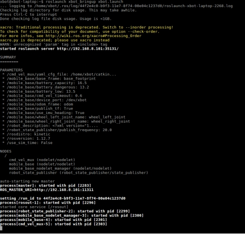
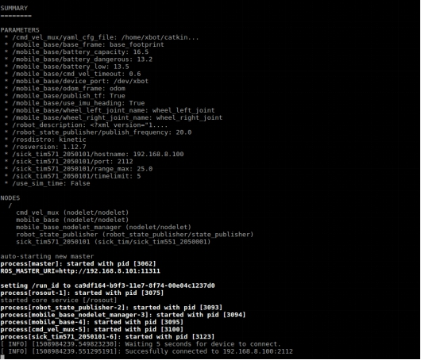
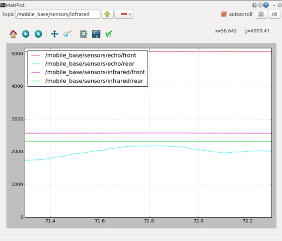
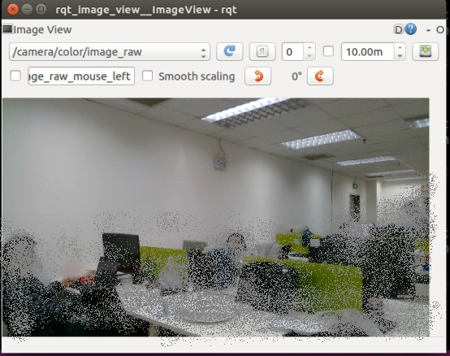
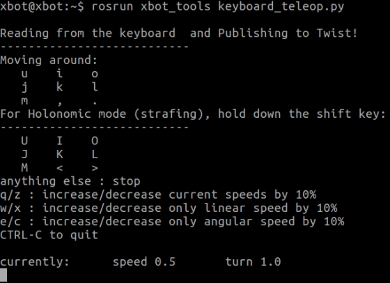

# 深入使用机器人

## 准备工作

APP仅仅是作为快速简单的控制机器人以及和机器人交互的一种便捷的工具。

作为一个技术爱好者或者研究人员，通过app控制机器人显然并不能满足您的要求。

除了APP之外，我们主要提供ROS 命令来深度了解和使用机器人，本章将具体介绍机器人的ROS系统以及使用。

深入使用机器人之前，您需要先安装ubuntu系统和安装ROS，具体方法请参照[准备工作一：安装ubuntu操作系统](install-ubuntu)和[准备工作二：安装ROS](install-ros)。

## 深入使用机器人的两种方式

### 方式一、本机使用

由于机器人不带显示屏，为了更好的交互，我们建议您使用机器人自带的HDMI、USB3.0接口连接外部显示器与键鼠，对机器人进行操控。

您需要准备一台带HDMI接口的显示器，无线鼠标键盘一套（推荐无线设备，有线设备亦可）。

在开机之前，将显示器的HDMI接口接入到机器人底盘上的HDMI接口上。将无线鼠标的发射器插入到机器人USB3.0口上。（此时您可以简单的将机器人看做一个普通的台式机主机）

开机之后，显示器就会显示Ubuntu操作系统的界面，此时我们就可以像使用一台普通的ubuntu操作系统的计算机那样使用机器人了。后续就是了解机器人的各种命令，并在ubuntu命令终端输入命令来查询或者操控机器人了。

###  方式二、远程登录使用

如果您的身边一时很难找到一台显示器和鼠标键盘，那么您也可以通过您的个人PC电脑连接机器人的wifi，通过ssh远程控制机器人的方式进行操控。关于ssh的使用方法，是linux的基础知识，这里略去不谈。

此外，全部ssh远程控制需要在每开启一个命令窗口的时候，都进行ssh远程登录，比较麻烦，因此您还可以利用ROS提供的主从机制，设置XBot端（ROS主机）与PC端的主从关系，从而通过您的个人计算机对机器人进行控制。

无论您使用哪种方式运行，请确保本章中的指令都是在机器人本体主机上运行的。

更多的使用方式可参考[ROS中使用机器人的三种方法](ros-setting)

## ROS功能包介绍

该软件包集包含7个ROS软件子包。

| ROS软件包              | 主要功能                                 |
| ---------------------- | ---------------------------------------- |
| xbot_bringup           | 驱动程序启动入口，包含多个launch文件     |
| xbot_driver            | 底层通讯驱动，收发数据                   |
| xbot_node              | ROS数据封装与分发，运动解算              |
| xbot_msgs              | 软件包集所用到的所有ROS消息类型          |
| xbot_safety_controller | 机器人安全控制程序                       |
| xbot_description       | ROS建模与urdf描述文件                    |
| xbot_tools             | 用于调试、开发以及运行过程的一些工具软件 |
| xbot_face              | 人脸识别程序                             |
| xbot_navi              | SLAM、导航规划程序                       |
| xbot_talker            | 机器人语音交互和对话程序                 |


## 各功能包程序启动

###  开机启动程序

机器人开机后默认会启动自启程序，程序延迟约20秒启动（打开红色开关开始计），该自动启动程序位于xbot_bringup/launch/xbot-u.launch。

也就是说，机器人开机自动运行了以下指令：

```bash
 roslaunch xbot_bringup xbot-u.launch
```

因此如果想要自己去启动该程序时，请首先关闭机器人的自动启动程序，否则会导致程序重复启动报错：

```bash
sudo service xbot stop
```

该指令需要您输入密码以确认权限。

该脚本里包含了Xbot的常用功能。输入该指令后后，机器人会启动底盘节点（包括机器人电机控制器，电机码盘，超声波传感器，红外传感器，电压电流检测器）、激光雷达、Realsense深度摄像头节点信息、人脸识别摄像头视频流等。

机器人的开机启动程序启动了以下内容：

1. xbot.launch
2. rplidar.launch
3. realsense.launch
4. pub_camera_image
5. face_recog.py
6. talker.launch
7. web_video_server
8. rosbridge_websocket.launch

### 驱动机器人底盘

如果你不想启动那么多功能，只想启动XBot-U机器人的部分功能，您也可以手动输入下面命令来启动XBot。

```
roslaunch xbot_bringup xbot.launch
```

该脚本所驱动起来的传感器包括机器人电机控制器，电机码盘，超声波传感器，红外传感器，电压电流检测器等。xbot.launch脚本所启动的功能相比xbot-u.launch脚本要少些，主要集中在机器人的运动控制方面。

启动该脚本后，你将在终端上看到以下内容，表示脚本启动成功：

r

### 驱动摄像头

XBot-U机器人配带有Intel RealSense 摄像头。

使用下面指令可单独启动Realsense摄像头。

```
 roslaunch xbot_bringup realsense.launch
```

### 驱动激光雷达

使用下面指令可以单独启动Rplidar激光雷达。

```
roslaunch xbot_bringup rplidar.launch
```

输入指令后，终端将显示如下信息，表示雷达启动成功。当雷达启动时输入，可以使雷达关闭。

 

如果您后续还需要启动其他节点，也可以使用不同指令启动相应的节点。

## 传感器数据查询

在驱动了机器人底盘之后，可以查看到以下数据。

###  核心传感器数据查询

键入命令

```
rostopic echo /mobile_base/sensors/core
```

即可查看相关传感器返回数据，也可以看到电机返回数据，返回数据信息格式如下：

```
---
header: 
 seq: 1262
 stamp: 
  secs: 1555999055
  nsecs: 768794824
 frame_id: ''
time_stamp: 23422			#时间戳
left_encoder: 0				#
right_encoder: 0			#
ischarging: True			#是否正在充电
battery_percent: 41			#剩余电量百分比
front_echo: 4461			#前方超声
rear_echo: 1873			#后方超声
front_infrared: 2598			#前方红外
rear_infrared: 2382			#后方红外
motor_disabled: False			#急停开关状态
left_motor_current: 1.31226110458	#
right_motor_current: 1.15603709221	#
error_state: 0				#错误状态码
version: 52				#版本号
---
```


输入命令:

```
rostopic echo /mobile_base/sensors/extra
```

可以显imu数据和云台角度数据等。数据格式如下：

```
---
header: 
 seq: 83
 stamp: 
  secs: 1556078520
  nsecs: 464847185
 frame_id: ''
yaw_platform_degree: 120		#水平云台角度
pitch_platform_degree: 120		#竖直云台角度
sound_is_mutex: True			#喇叭静音
acc_x: 4.1225104332			#imu加速度
acc_y: 0.0				#imu加速度
acc_z: -1.64187479019			#imu加速度
gyro_x: 14.162528038			#imu角速度
gyro_y: -3.26288318634			#imu角速度
gyro_z: -69.6071166992			#imu角速度
mag_x: 723.599975586			#imu磁力计
mag_y: 1228.80004883			#imu磁力计
mag_z: 9830.25			#imu磁力计
yaw: -3.7101585865			#imu_偏航角
pitch: -0.398658037186			#imu_俯仰角
roll: -179.962387085			#imu_翻滚角
q1: -0.00033110845834			#imu_四元数（q1-q4）
q2: 0.999469876289			
q3: -0.0323674604297
q4: 0.00349123124033
error_state: 0				#错误代码
time_stamp: 29931			#时间戳
version: 101				#版本号
---
```


###  红外与超声传感器

键入

```
rqt_plot
```

在该界面中，上面的框中敲入/mobile则下面自动出现很多传感器备选项，末尾以echo结尾的，是超声传感器，以infrared结尾的，是红外测距传感器，我们加上这两种传感器，可查看对应屏幕显示的波纹变化。

 

### 里程计数据查询

输入

```
rostopic echo /odom
```

可以查询到机器人的里程计数据。

```
---
header: 
  seq: 13367
  stamp: 
    secs: 1593859380
    nsecs: 768068002
  frame_id: "odom"
child_frame_id: "base_footprint"
pose: 
  pose: 
    position: 
      x: 0.315393779014
      y: -0.0360570059239
      z: 0.0
    orientation: 
      x: 0.0
      y: 0.0
      z: -0.023131703537
      w: 0.999732426348
  covariance: [0.1, 0.0, 0.0, 0.0, 0.0, 0.0, 0.0, 0.1, 0.0, 0.0, 0.0, 0.0, 0.0, 0.0, 1.7976931348623157e+308, 0.0, 0.0, 0.0, 0.0, 0.0, 0.0, 1.7976931348623157e+308, 0.0, 0.0, 0.0, 0.0, 0.0, 0.0, 1.7976931348623157e+308, 0.0, 0.0, 0.0, 0.0, 0.0, 0.0, 0.05]
twist: 
  twist: 
    linear: 
      x: 0.1977389028
      y: 0.0
      z: 0.0
    angular: 
      x: 0.0
      y: 0.0
      z: 0.0233670026064
  covariance: [0.0, 0.0, 0.0, 0.0, 0.0, 0.0, 0.0, 0.0, 0.0, 0.0, 0.0, 0.0, 0.0, 0.0, 0.0, 0.0, 0.0, 0.0, 0.0, 0.0, 0.0, 0.0, 0.0, 0.0, 0.0, 0.0, 0.0, 0.0, 0.0, 0.0, 0.0, 0.0, 0.0, 0.0, 0.0, 0.0]
---
```

###  摄像头数据查看

如何查看摄像头图像呢，键入命令：

```
rqt_image_view
```

选择color/image_raw即可查看上面的摄像头显示情况，而选择camera/image则可以通过下部的摄像头查看情况：

 


以上是人脸识别摄像头图像的查看,更换topic即可查看realsense摄像头的彩色摄像头图像.与摄像头相关topic如下：

realsense-rgb图像：/camera/color/image_raw
人脸识别摄像头：/xbot/camera/image


## 机器人控制

### 键盘遥控

> 注意，该部分程序建议使用方式二远程登录使用，否则请注意机器人拖着鼠标键盘以及显示器走。

键入命令

```
rosrun xbot_tools keyboard_teleop.py
```

按照命令窗口提示的信息按键，可以控制机器各方向移动。

 


**注意**：

当您控制机器人运动发现机器人无反应时，请检查两件事情：

1. 鼠标是否定位在上图所示的命令窗口。

2. 急停按钮状态。按下则无法运动是正常的，需要让急停按钮弹起再试。

 

### 云台控制

键入以下命令，修改data后的值，可以控制竖直云台俯仰指定角度，模拟抬头低头的动作。data的值域范围为[-60,30]。

```
 rostopic pub -1 /mobile_base/commands/pitch_platform std_msgs/Int8 “data: 0”
```

键入以下命令，修改data后的值，可以控制水平云台左右旋转指定角度，模拟左右转头动作。data的值域范围为[-90,90]。

```
rostopic pub -1 /mobile_base/commands/yaw_platform std_msgs/Int8 “data: 0”
```

 查看舵机偏转角是否运转正常。


### 软急停控制

输入指令：

```
rostopic pub -1 /mobile_base/commands/motor_enable std_msgs/Bool "data: false"
```

 即可控制机器人软急停，此时使用键盘遥控机器人无法行走。


