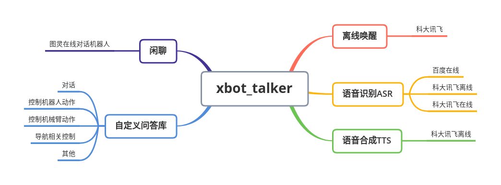
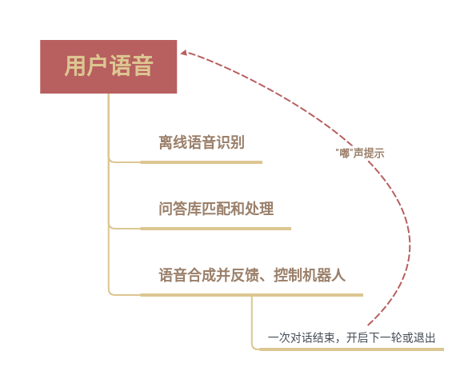

# xbot_talker

## 一.简介

xbot_talker是用于重德智能XBot-U科研教学平台机器人的**语音交互**ROS程序包。

该程序包提供了百度在线语音识别、科大讯飞离线唤醒、科大讯飞语音识别、科大讯飞离线命令词识别、科大讯飞离线语音合成以及机器人控制、图灵对话机器人模块的调用，以及完整的智能语音交互系统，能够通过语音控制机器人动作、导航以及对话聊天等功能。



特性：

- 1.模块化。语音识别、语音唤醒、语音合成和语言处理等都做到了模块化，各个模块间通过ROS话题或服务进行通信，方便测试以及用户开发自己的插件。
- 2.灵活可配置，用户可选择启动一个或多个模块，可定制机器人的名字、唤醒词，添加、修改离线命令词和问答库。
- 3.已提供一套集成离线语音识别、离线语音合成以及离线语言处理的启动程序和参数配置，可在Xbot-U系列机器人上应用。
- 4.除了Xbot-U系列机器人，该功能包同时可应用于任何基于ROS开发的机器人。

## 二.安装依赖

下载功能包后请先连通网络，进入到xbot_talker功能包所在的工作空间，通过以下命令安装依赖：

```
sudo apt install sox
sudo apt install libsox-fmt-all
rosdep install --from-paths src --ignore-src -r -y
```

安装完成后编译代码:

```
catkin_make
```

## 三.语音交互使用说明

功能包里已配置好talker.launch启动文件，可以启动离线命令词识别、语音合成以及离线nlp处理功能，实现离线对话交互以及对机器人的控制。同时也提供了集成所有功能的xbot_talker.launch启动文件。如果需要使用在线识别和语音唤醒等功能，请参考后面的**语音交互进阶使用手册**修改参数和设置。本章节只介绍基础功能的使用。

语音交互模块的启动已集成到xbot-u.launch中随机器人开机启动，使用该模块只需在机器人或者从机上调用相应的service，并修改相应的请求参数，即可打开语音交互模块。

**注意:与3.2.4之前版本兼容的接口/xbot/play和/xbot/chat的使用在本章节末尾。**

使用前，先调用/talker/version服务查看语音交互软件版本：

```
rosservice call /talker/version "empty: {}" 
```

本手册适用于3.2.4及以上版本的代码。

### 3.1文字合成语音并播放

用户可以调用/talker/play服务将文字合成语音并播放（语音合成），具体指令为：

```
rosservice call /talker/play "loop_times: 0
mode: 0
audio_path: ''
tts_text: '语音合成测试'" 
```

其中您可以将‘语音合成测试’替换为任何您想要播放的文字，也可修改loop_times设置循环播放次数。语音播放成功后，终端会输出相应的提示：

```
success: True
```

在输入指令时，您可以使用Tab键来自动补全指令，以避免指令输入错误。补全指令后您只需修改相应参数即可。

请求的参数说明：

- loop_times：表示循环播放的次数，0表示只播放一遍，1表示共播放2遍…loop_times表示共播放(loop_times+1)遍。
- mode：播放模式。0表示把文字（tts_text）合成语音并播放；1表示播放指定的文件（audio_path）。
- audio_path：mode = 1时播放的音频文件。
- tts_text：mode =0 时转化的文字。

### 3.2播放指定的语音文件

用户可以调用/talker/play服务播放指定音频文件，具体指令为：

```
rosservice call /talker/play "loop_times: 0
mode: 1
audio_path: '~/catkin_ws/src/xbot/xbot_talker/defaultconfig/audio/default_tts_test.wav'            
tts_text: ''" 
```

其中audio_path后面是您想要播放的语音文件的路径，该路径为**机器人本机上**的绝对目录位置，可自行修改。

在输入指令时，您可以使用Tab键来自动补全指令，以避免指令输入错误。补全指令后您只需修改相应参数即可。

### 3.3对话和语音控制

/talker/chat服务提供了与机器人进行对话以及通过语音控制机器人的交互功能。运行以下命令，即可进行交互：

```
rosservice call /talker/chat "start_chat: true"
```

执行该指令后，机器人会发出“嘟”声，您在听到声音之后即可以开始与机器人交谈。工作模式如下图：



结束对话时需要告诉机器人“关闭”或"关闭对话"。在机器人接收到语音输入的关闭指令后，会结束对话。

初始配置的机器人已经能够回答一些简单的问题，包括：你好、你多大了、你是谁、你叫什么名字、你会什么、介绍一下你自己等，以及对机器人的基本控制，"向前走一步"、"向后走一步"、"向左旋转"、"向右旋转"等，同时预留了控制机械臂和导航模块的接口。

**注意**：请在机器人响应完毕，听到“嘟”声结束后立即说命令词。预留的控制机械臂的相关命令有一定的响应时间（7s)左右，关于机械臂控制和导航相关的命令，请参考机械臂和导航使用手册。导航相关命令词会自动退出chat模式。

基本的交互内容如下表：

| 关键词                                                | 识别成功后语音回答                                           | 动作响应                                                     | 备注                                                         |
| ----------------------------------------------------- | ------------------------------------------------------------ | ------------------------------------------------------------ | ------------------------------------------------------------ |
| 向前走/向前走一步                                     | 无                                                           | 机器人向前一段距离                                           |                                                              |
| 向后走/向后走一步                                     | 无                                                           | 机器人后退一段距离                                           |                                                              |
| 向左旋转/向左转                                       | 无                                                           | 机器人向左旋转                                               |                                                              |
| 向右旋转/向右转                                       | 好的                                                         | 机器人向右旋转                                               |                                                              |
| 你好                                                  | 你好，我是机器人小德                                         | 无                                                           |                                                              |
| 你叫什么名字                                          | 我叫小德                                                     | 无                                                           |                                                              |
| 你多大了/你几岁了                                     | 我已经三岁啦                                                 | 无                                                           |                                                              |
| 你来自哪里                                            | 我来自重德智能                                               | 无                                                           |                                                              |
| 介绍一下你自己/你自我介绍一下/介绍你自己/你是谁       | 我是来自重德智能的机器人小德。集科研、教育、服务于一身。能为您提供自主导航、人脸识别、语音交互和自动抓取等多种功能。 | 无                                                           |                                                              |
| 你会什么/你会做什么                                   | 我具有自主导航、人脸识别、语音交互、自动抓取等多种功能，将是您学习和科研的好帮手。 | 无                                                           |                                                              |
| 介绍一下重德智能/介绍重德智能                         | 北京中科重德智能科技有限公司是源自中国科学院的创业公司。公司致力于研发智能机器人科研教学平台。提供稳定可靠、安全高效的机器人软硬件一体化解决方案 | 无                                                           |                                                              |
| 你爸爸是谁                                            | 我爸爸是重德智能帅气可爱的工程师哟                           | 无                                                           |                                                              |
| 你妈妈是谁                                            | 我妈妈是重德智能漂亮可爱的工程师哟                           | 无                                                           |                                                              |
| 很高兴见到你                                          | 和你的每一次遇见都是我的小确幸。                             | 无                                                           |                                                              |
| 你喜欢什么                                            | 我最喜欢和你聊天啦                                           | 无                                                           |                                                              |
| 向上看                                                | 无                                                           | 头部俯仰云台向上偏转40度                                     |                                                              |
| 向下看                                                | 无                                                           | 头部俯仰云台向下偏转40度                                     |                                                              |
| 向左看                                                | 无                                                           | 头部水平云台向左偏转60度                                     |                                                              |
| 向右看                                                | 无                                                           | 头部水平云台向右偏转60度                                     |                                                              |
| 向前看/转台回到初始位置                               | 无                                                           | 头部两个云台回到初始0度位置                                  |                                                              |
| 开始对话/开始多轮交互模式                             | 好的，我们可以进行连续多次对话交互啦。                       | 无                                                           | 在语音唤醒模式下，该关键词会开始多轮交互模式。               |
| 陪我聊天/能和我聊会天吗                               | 好啊，我们可以聊天啦。                                       | 无                                                           | 在语音唤醒模式下，该关键词会开始多轮交互模式。               |
| 再见                                                  | 期待与你的下次相遇                                           | 退出/chat服务，结束对话。                                    | 在语音唤醒模式下，该关键词会退出多轮交互模式，进入等待唤醒状态。 |
| 关闭/关闭对话/关闭多轮交互模式/退出聊天/退出对话      | 好的，小德先退下啦。                                         | 退出/xbot/chat服务，结束对话。                               | 在语音唤醒模式下，该关键词会退出多轮交互模式，进入等待唤醒状态。 |
| 抬起左手/放下左手/抬起右手/放下右手/抬起手臂/放下手臂 | 好的                                                         | 控制机械臂的抬起和放下                                       | 若购买xbot-arm产品，会看到机械臂动作，请确保机械臂0.7m范围内无障碍物。 |
| 张开左手/闭合左手/张开右手/闭合右手/张开手爪/闭合手爪 | 好的                                                         | 控制机械臂手爪的打开和闭合                                   |                                                              |
| 参观/带我参观                                         | 好的。请跟我来                                               | 向/demo/leave、/demo/visit和/welcome/yes话题发布true，同时自动退出对话 | 用户可自行编写脚本订阅这三个话题其中一个，开始导航。         |
| 开始导航                                              | 收到。                                                       | 向/demo/leave、/demo/visit和/welcome/yes话题发布true，同时自动退出对话交互 | 用户可自行编写脚本订阅这三个话题其中一个，开始导航。         |
| 暂停导航                                              | 收到                                                         | 向/demo/navi_pause话题发布true，同时自动退出对话             |                                                              |
| 继续导航                                              | 收到                                                         | 向/demo/navi_continue话题发布true，同时自动退出对话          |                                                              |
| 回到原点/回到起点/小德你回去吧                        | 好的，我将返回起始点。                                       | 向/demo/navi_to_pose话题发布”Starting_Point“，同时自动退出对话 | 目标点的信息需与导航json文件内的设置对应。                   |
| 去第一个目标点                                        | 收到                                                         | 向/demo/navi_to_pose话题发布”First_Goal“，同时自动退出对话   | 目标点的信息需与导航json文件内的设置对应。                   |
| 去第二个目标点                                        | 收到                                                         | 向/demo/navi_to_pose话题发布”Second_Goal“，同时自动退出对话  | 目标点的信息需与导航json文件内的设置对应。                   |
| 去第三个目标点                                        | 收到                                                         | 向/demo/navi_to_pose话题发布”Third_Goal“，同时自动退出对话   | 目标点的信息需与导航json文件内的设置对应。                   |
| 去第四个目标点                                        | 收到                                                         | 向/demo/navi_to_pose话题发布”Fourth_Goal“，同时自动退出对话  | 目标点的信息需与导航json文件内的设置对应。                   |
| 去第五个目标点                                        | 收到                                                         | 向/demo/navi_to_pose话题发布”Fifth_Goal“，同时自动退出对话   | 目标点的信息需与导航json文件内的设置对应。                   |
| 带我找方总/去方总办公室                               | 无                                                           | 向/demo/navi_to_pose话题发布”fang_zong_office“，同时自动退出对话 | 目标点的信息需与导航json文件内的设置对应。                   |
| 带我找常总/去常总办公室                               | 无                                                           | 向/demo/navi_to_pose话题发布”chang_zong_office“，同时自动退出对话 | 目标点的信息需与导航json文件内的设置对应。                   |

### 3.4兼容3.2.4版本之前接口使用说明

#### 播放指定的音频文件

让机器人播放语音文件，mode:1 表示播放指定目录下的音频文件，具体的指令为：

```
rosservice call /xbot/play "loop: false
mode: 1
audio_path: '~/catkin_ws/src/xbot/xbot_talker/defaultconfig/audio/default_tts_test.wav'
tts_text: ''"
```

其中audio_path后面是您想要播放的语音文件的路径，该路径为**机器人本机上**的绝对目录位置，可自行修改。

#### 将输入的文字转化为语音

您可以让机器人播放您输入的文字，只需要在机器人终端中输入如下指令启动/xbot/play服务即可，mode:2 表示播放模式为将文字转化为语音：

```
rosservice call /xbot/play "loop: false
mode: 2
audio_path: ''
tts_text: '请和我打招呼'"
```

其中您可以将‘请和我打招呼’替换为任何您想要播放的文字。语音播放成功后，终端会输出相应的提示：

```
让机器人播放语音文件，mode:1 表示播放指定目录下的音频文件，具体的指令为：

success: True
```

在输入指令时，您可以使用Tab键来自动补全指令，以避免指令输入错误。补全指令后您只需修改相应参数即可。

#### 对话和语音控制

/xbot/chat服务提供了与机器人进行对话以及通过语音控制机器人的交互功能。运行以下命令，即可进行交互：

```
rosservice call /xbot/chat "start_chat: true"
```

执行该指令后，机器人会在一段时间内发出“嘟——嘟——”声，您在听到声音之后即可以开始与机器人交谈。

结束对话时需要告诉机器人“关闭”。在机器人接收到语音输入的关闭指令后，会结束对话。

## 其他手册

- 《如何添加或修改对话内容》：xbot_talker/doc/how_to_modify_QA_library.md
- 《xbot_talker各个模块完整说明》：xbot_talker/doc/description_of_each_module.md

## 联系我们

**商务合作**：[bd@droid.ac.cn](mailto:bd@droid.ac.cn)

**技术咨询**：[wangxiaoyun@iscas.ac.cn](mailto:wangxiaoyun@iscas.ac.cn)

