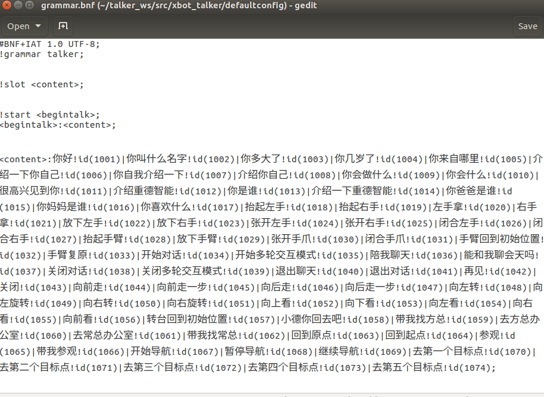

# xbot_talker:自定义对话内容

初始配置的机器人已经能够回答一些简单的问题，包括：你好、你多大了、你是谁、你叫什么名字、你会什么、介绍一下你自己等，以及对机器人的基本控制，"向前走一步"、"向后走一步"、"向左旋转"、"向右旋转"等，同时预留了控制机械臂和导航模块的接口。

对话交互内容请参考《使用手册》里的表格。

用户也可按照下面的教程修改或添加自定义的对话内容。

### 1.配置文件说明

与定义对话内容相关的配置文件有两个，一个是语法文件，一个是定义的对话库。

xbot_talker/defaultconfig/grammar.bnf离线语法文件是科大讯飞离线命令词识别的基础，里面定义了能够被离线识别的所有关键词（在线识别可随意输入，不受影响）。文件内容如下：

xbot_talker/defaultconfig/answer_dic.csv文件是离线语言处理问答库，里面定义了与语法文件中对应的关键词的所有相应策略。nlp模块接收到语音识别结果后，会到此文件搜索响应的策略并进行响应。

文件部分内容如下图所示：

answer_dic.csv表格内一共有四列:

- 第一列为语音识别的关键词，与grammar.bnf离线语法文件内定义一致；
- 第二列为对应的回答或其他响应；
- 第三列数字代表机器人的动作编号RobotAciton。
  - RobotAciton编号和对应动作如下表：

| 编号 | 动作行为                  | 说明                                                         |
| ---- | ------------------------- | ------------------------------------------------------------ |
| 0    | NO_ACTION                 | 无动作响应                                                   |
| 1    | CLOSE_CHAT                | 关闭chat对话模式                                             |
| 2    | START_CHAT                | 进入chat对话模式，用户可在嘟声后连续进行多次对话交互         |
| 101  | TAKE_A_STEP_FORWARD       | 向/cmd_vel_mux/input/teleop话题发消息控制机器人前进一步      |
| 102  | TAKE_A_STEP_BACKWARD      | 向/cmd_vel_mux/input/teleop话题发消息控制机器人后退一步      |
| 103  | TURN_LEFT                 | 向/cmd_vel_mux/input/teleop话题发消息控制机器人向左旋转      |
| 104  | TURN_RIGHT                | 向/cmd_vel_mux/input/teleop话题发消息控制机器人向右旋转      |
| 105  | LOOK_UP                   | 向/mobile_base/commands/pitch_platform发消息控制俯仰云台向上转40度 |
| 106  | LOOK_DOWN                 | 向/mobile_base/commands/pitch_platform发消息控制俯仰云台向下转40度 |
| 107  | LOOK_LEFT                 | 向/mobile_base/commands/yaw_platform 发消息控制水平云台向左转60度 |
| 108  | LOOK_RIGHT                | 向/mobile_base/commands/yaw_platform 发消息控制水平云台向右转60度 |
| 109  | LOOK_FORWARD              | 两个云台回到初始0度位置。                                    |
| 201  | RESET_ARM                 | 向/arm/commands/reset发消息控制所有机械臂回到初始位置        |
| 202  | RAISE_LEFT_HAND           | 向/left_arm/commands/lift_up 发消息控制双臂机械臂的左臂抬起来 |
| 203  | PUT_DOWM_LEFT_HAND        | 向/left_arm/commands/put_down 发消息控制双臂机械臂的左臂回到初始位置 |
| 204  | RAISE_RIGHT_HAND          | 向/right_arm/commands/lift_up 发消息控制双臂机械臂的右臂抬起来 |
| 205  | PUT_DOWM_RIGHT_HAND       | 向/right_arm/commands/put_down 发消息控制双臂机械臂的右臂回到初始位置 |
| 206  | LEFT_HAND_GRIP            | 向/left_arm/commands/grip 发true控制双臂中左手手爪闭合       |
| 207  | LEFT_HAND_OPEN            | 向/left_arm/commands/grip 发false控制双臂中左手手爪张开      |
| 208  | RIGHT_HAND_GRIP           | 向/right_arm/commands/grip 发true控制双臂中右手手爪闭合      |
| 209  | RIGHT_HAND_OPEN           | 向/right_arm/commands/grip 发false控制双臂中右手手爪张开     |
| 210  | RAISE_ARM                 | 向/arm/commands/lift_up 发消息控制单臂机械臂抬起来           |
| 211  | PUT_DOWN_ARM              | 向/arm/commands/put_down 发消息控制单臂机械臂回到初始位置    |
| 212  | OPEN_GRIPPER              | 向/arm/commands/grip发false控制单臂机械臂的手爪的张开        |
| 213  | CLOSE_GRIPPER             | 向/arm/commands/grip发true控制单臂机械臂的手爪的闭合         |
| 301  | NAVI_START                | 向/demo/leave、/demo/visit和/welcome/yes话题发布true，同时自动退出对话交互 |
| 302  | NAVI_TO_POSE              | 向/demo/navi_to_pose话题发布answer_dic.csv表格第二列内设置的关键点string，同时自动退出对话开始导航，例如设置为“chang_zong_office” |
| 303  | NAVI_CANCEL               | 向/demo/navi_pause话题发布true，暂停导航，同时自动退出对话   |
| 304  | NAVI_CONTINUE             | 向/demo/navi_continue话题发布true，继续导航，同时自动退出对话 |
| 305  | BACK_TO_ORIGINAL_LOCATION | 向/demo/navi_to_pose话题发布”Starting_Point“，导航至起点，同时自动退出对话 |
| 311  | NAVI_TO_FIRST_POSE        | 向/demo/navi_to_pose话题发布”First_Goal“，同时自动退出对话   |
| 312  | NAVI_TO_SECOND_POSE       | 向/demo/navi_to_pose话题发布”Second_Goal“，同时自动退出对话  |
| 313  | NAVI_TO_THIRD_POSE        | 向/demo/navi_to_pose话题发布”Third_Goal“，同时自动退出对话   |
| 314  | NAVI_TO_FOURTH_POSE       | 向/demo/navi_to_pose话题发布”Fourth_Goal“，同时自动退出对话  |
| 315  | NAVI_TO_FIFTH_POSE        | 向/demo/navi_to_pose话题发布”Fifth_Goal“，同时自动退出对话   |

- 第四列编号为 动作模式ActionMode，编号和说明如下表

  | 编号 | 模式                 | 说明                                                         |
  | ---- | -------------------- | ------------------------------------------------------------ |
  | 0    | PLAY_ONLY            | 将answer_dic.csv表格第二列内的文字转化成语音并播放回答，无任何动作响应。 |
  | 1    | ACTION_ONLY          | 只根据answer_dic.csv表格第三列内的RobotAciton进行动作，无任何语音回答。 |
  | 2    | PLAY_BEFORE_ACTION   | 先播放语音回答再动作。                                       |
  | 3    | PLAY_AND_ACTION_SYNC | 播放语音回答和动作同时进行。                                 |
  | 4    | PLAY_AFTER_ACTION    | 先进行动作，再播放语音回答。                                 |

### 2.只修改语音回答或反馈

参照上一小节的说明，用户若想修改某个关键词对应的语音回答或反馈提示，只需修改xbot_talker/defaultconfig/answer_dic.csv文件第二列的内容。

例如，关键词“你喜欢什么”设定的原回答是“我最喜欢和你聊天啦”，用户可修改第二列的“我最喜欢和你聊天啦”为其他回答“我喜欢学习。也喜欢你”。

**注意:第二列的回答如果分多语句，中间不可用英文标点，最好都用中文句号隔开。**

修改后保存，重新启动程序，与机器人对话，就可听到机器人的回答已改变。

### 3.添加自定义关键词和问答库

除了已经设定好的离线关键词，用户还可以自己添加关键词，设置问答库。

- 1.在defaultconfig/grammar.bnf离线语法文件内添加关键词。打开语法文件，在文件末尾添加需要被识别的关键词，id号依次递增。例如想添加一个命令控制机器人开始在博物馆内导航，可以在语法文件末尾添加关键词“|带我参观博物馆!id(1075)”，文件修改后如下：

  

- 2.接着在defaultconfig/answer_dic.csv文件内添加响应策略。第一列输入“带我参观博物馆”，第二列输入想要的回答语句，例如“好的。请跟我来。我将为您导航”，第三列按照第一小节的表格，设置RobotAction为301（NAVI_START），第四列设置动作模式为2（先播放语音回答再动作）。

  

- 3.保存文件的修改并重新启动程序，可与机器人进行交互，设置成功后机器人可准确识别关键词“带我参观博物馆”并反馈语音回答，回答结束后向/demo/leave、/demo/visit和/welcome/yes话题发布true。具体的导航行为请参考导航章节。

